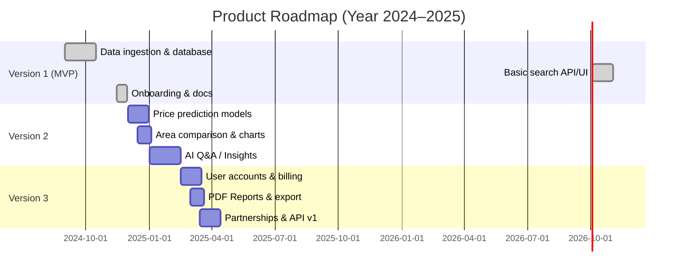

# Market Research - ChatGPT

# Executive Summary  
This report analyzes the **UK housing intelligence platform** landscape and opportunities. We find that existing products range from free portal data (Rightmove, Zoopla) to specialized analytics tools (e.g. PropertyData, Realyse, Dataloft/PriceHubble) targeting investors and advisors.  Target segments include first-time homebuyers (~390K purchases/year), home movers, investors/landlords, mortgage advisers (~24K) and estate agents (tens of thousands).  Key public data (e.g. Land Registry prices, EPC ratings, ONS demographics) are available under open licences.  Data gaps include incomplete rental records, new-build lags and uneven address coverage.  To differentiate from listing sites, viable features might include AI-driven forecasts, risk and amenity overlays, custom reports and QA chat (as exemplified by tools like HomePortfolio).  Monetization could mix one-off reports (e.g. £5–£15 per detailed report), subscriptions, affiliate/referral partnerships and API licensing.  An MVP (V1) should focus on core data ingestion (Land Registry, EPC, OS maps) and basic search/reports, with V2 adding forecasting models and interactive analysis, and V3 adding user accounts, payments and integrations.  Throughout, compliance with GDPR/open data licences and clear “for information only” disclaimers are essential.  Proposed KPIs include site traffic, conversion rate, paid users, churn and LTV.  Below we detail competitors, market size, data sources, features, monetization models, roadmap, and other considerations.

## Competitive Landscape  
Several players already offer UK property intelligence.  **Listing portals** (Rightmove, Zoopla, OnTheMarket) provide free search and basic stats (asking prices, sold prices, HPI charts), but limited analytics.  **Analytics platforms** target professionals: e.g. **PropertyData** (UK’s “leading analytics tool” for investors/developers) offers area research, yield/histograms, comparables, off-market sourcing; pricing starts ~£14/month.  **Property Market Intel (PMI)** offers similar investor tools (deal sourcing, STR analytics) with 100% UK coverage and real-time data.  **PriceHubble** (with Dataloft) provides a B2B API for valuations, growth forecasts and rent demographics.  **Realyse** is a data platform (subscription/API) with a consumer “Pulse” site offering free valuations, ownership info and market trends for buyers/sellers.  **Dealsourcr** is an AI deal-sourcing app for property investors, pre-indexing the market to find below-market-value and negative-equity deals, with built-in calculators and comps lookup.  Finally, solo developers have begun building “aggregate” tools: for example, a Reddit user created **HomePortfolio**, an AI search app that scrapes 50+ UK sources (Land Registry, EPC, planning, crime, listings, etc.) into property profiles with valuations, yields, risk layers and chat Q&A.  (Table 1 compares key offerings.)

| **Competitor**         | **Primary Users**                     | **Key Features**                                                | **Pricing / Model**             | **Notes (Strengths/Weaknesses)**                                      |
|------------------------|---------------------------------------|-----------------------------------------------------------------|---------------------------------|-----------------------------------------------------------------------|
| **Rightmove/Zoopla**   | Homebuyers, general public            | Free listings search; HPI charts; instant AVMs (free)           | Free (ad-supported)             | Huge traffic; basic market stats; no deep analysis or alerts.         |
| **PropertyData**       | Investors, developers, advisers       | Area analytics, price/growth/yield charts, comparables, deal-finder, AI Q&A | Subscription from £14/mo | Very data-rich; user-friendly; strong reviews (4.6★).   |
| **Property Market Intel** | Property investors, SA managers     | Live market data, local research, STR analytics, comparables    | Subscription (7-day free trial) | Real-time updates; covers 64+ sources; dedicated Chrome extension.   |
| **PriceHubble / Dataloft** | Banks, agents, insurers (B2B)      | Valuations, growth forecasts, rent maps; retail (Dataloft) platform | Enterprise API pricing         | Deep analytics; UK & EU data; strong corporate backing; pricey.       |
| **Realyse (Pulse)**    | Agents, buyers, mortgage brokers      | Online valuations, ownership details, area trends   | Freemium (basic free; enterprise plans) | Accurate valuations (claimed “UK’s most accurate”); API available.   |
| **Dealsourcr**         | Property investors, deal sourcers     | AI deal finder (renovations, HMOs, SA); ROI calculators; comps | Subscription (7-day trial)      | Focused on high-ROI deals; includes negative-equity search.           |
| **HomePortfolio (DIY)**| Ambitious first-time buyers/investors | Property lookup with scraped data: valuations, yields, flood, schools, chat-Q&A | Personal project (not commercial) | Innovative feature set; proof of concept for integrated data use.     |

*Table 1: Example competitors and their offerings.*  

## Target Market Size & Segments  
Key UK home-buying segments (annual estimates): **First-time buyers** ~390,000 (year to Sept 2025).  **Home movers** (second or later buyers) likely outnumber FTBs, with ~1–1.5 million home transactions per year.  **Property investors** (buy-to-let landlords) own ~2.6 million mortgaged BTL properties in England/Wales (2024) – a sizeable audience for data-driven investing.  **Advisers and intermediaries** include ~24,400 mortgage brokers/advisers (FCA-registered) and about 26,000 estate agency firms (statista/IBISWorld).  **Financial advisers** (IFAs) in mortgage/wealth also number in the tens of thousands.  Together, these segments suggest a market of at least half a million users with buying power.  They can be broken down (Table 2):

| **Segment**               | **UK Estimate & Source**                  | **Needs**                                |
|---------------------------|------------------------------------------|------------------------------------------|
| First-Time Buyers (FTB)   | ~390k/year                | Affordability, area prospects, schools   |
| Home Movers (repeat buyers) | ~800k–1.2M/year (approx)                 | Timing, price negotiation, local trends  |
| Property Investors/Landlords | ~2.6M BTL properties (Eng/Wales, 2024)  | Yield analysis, deal sourcing, exit ROI  |
| Mortgage Brokers/Advisers | ~24,400 (2023)              | Market insight tools for clients         |
| Estate Agents             | ~26k firms (2026 est.)                   | Market analytics, CMA intelligence       |
| Developers/Housebuilders  | ~240k new homes/year (UK)                | Site selection, demand/supply trends     |

*Table 2: Market segments and scale.*  

## Key Public Datasets  
Numerous official UK datasets can feed the platform.  Examples (with update frequency and access):

| **Dataset**                | **Type/Content**                             | **Update**      | **Access/Fields**                                          | **License**         |
|----------------------------|----------------------------------------------|-----------------|-----------------------------------------------------------|---------------------|
| HM Land Registry – *Price Paid Data* | All residential property transactions (E/W) | Monthly (20th working day) | CSV files via gov.uk; fields include price, date, property type, postcode, PAON/SAON, locality, etc | Open Government Licence |
| HM Land Registry – *Others* (e.g. Register) | Titles, ownership records (paid access)    | Monthly updates  | API or download (subscription)                              | Commercial         |
| Energy Performance Certificates (EPC) | Building energy ratings (domestic/non-domestic) | Updated continuously (since 2012) | Download via MHCLG bulk CSV/API; contains property address, EPC rating, floor area, CO₂, etc. | OGL |
| ONS Census (2021) and surveys | Demographics (age, ethnicity, income), household composition | Decennial (census), periodic surveys | API/ONS site; data at LSOA/ward/LAD level                    | Open Government (Census output) |
| Indices of Deprivation (UK) | Composite score by small area (crime, health, etc.) | 2019, updated periodically | Download from MHCLG; includes decile/score by LSOA            | OGL (for summary)  |
| Dwelling Stock (DLUHC)     | Total homes, by type/tenure (England)       | Annual           | GOV.UK reports (Excel) (counts by LA)         | OGL                |
| Local Plans/Planning Apps  | Planning applications (by local council)    | Continuous (varies) | No central API (each council); commercial aggregators exist | Public but fragmented |
| Crime Data (Police.UK)     | Crime incidents by location/type           | Monthly          | API accessible (crime by postcode/area);  
                     | Open Government       |
| OS OpenData (Boundaries)   | Administrative/LSOA boundaries              | Occasional (2020) | Shapefiles via OS; postal geography, transport links        | Open Data Licence  |
| Transport (DfT)            | Travel to work, station locations           | Periodic         | Commute flows (Census/TfL); station coords via ORR            | Public domain      |
| Flood Risk (EA)            | Flood zone, surface water risk            | Annual maps      | API (Environment Agency) or shapefiles                       | Open Government    |
| School Performance (DfE)   | OFSTED ratings, results by school         | Annual           | DfE data portal (e.g. attendance, outcomes)                   | Open Government    |
| Others (e.g. PTAs, etc.)   | Various (parks, shops, etc.)              | As per release   | OS Points of Interest, OpenStreetMap, etc.                    | Vary (usually ODbL) |

*Table 3: Key public and official data sources for housing analytics.*  

All these sources are (mostly) open-licensed (OGL 3.0 or similar) or publicly accessible, but they differ in coverage and update frequency. For instance, Land Registry’s Price Paid is *monthly* and comprehensive for sales, whereas the Census is every 10 years. Many local datasets (council data, listings) require scraping or third-party APIs.

## Data Quality & Gaps  
- **Coverage gaps**: No single source covers everything. Land Registry excludes private mortgages/new-builds until sale; EPCs exist only if a home was marketed/rented; rental transaction data is not centrally recorded (no UK rent register).  Planning data is siloed by council.  
- **Timeliness**: Some data lags by months (e.g. Price Paid), others by years (Census). Rapid market changes (pandemic, policy shifts) may outpace official stats.  
- **Granularity**: Many stats are at local-authority or LSOA level. Street-level or real-time demand data are scarce outside listing portals.  
- **Accuracy/Consistency**: Address matching (UPRN) is often needed to link datasets (as noted by HomePortfolio’s developer). Data quality issues (typos, outliers) must be handled.  
- **Licensing compliance**: All government data cited above allows commercial use under OGL, but care is needed not to republish Royal Mail address data beyond permitted use. Scraping private portals (Rightmove/Zoopla) can breach terms; better to rely on open or licensed APIs.

## Differentiating Features (vs Portals)  
Most property portals focus on listing properties. A successful intelligence platform should go beyond this by offering:  
- **Data Integration & Analysis**: Combine multiple data streams (prices, rent, planning, schools, transit, demographics, crime, etc.) into a unified view. E.g. overlays of flood risk, school quality and crime stats on a map.  
- **Predictive Insights**: Automated forecasts (e.g. future price trends, rental yield projections) using models trained on historical data. (HomePortfolio’s draft yields/ROI module is an example.)  
- **Alerts & Recommendations**: “Smart alerts” for nearby planning approvals or price changes; neighborhood discovery (areas that fit user criteria).  
- **AI/Q&A Interface**: Chat or question-answer features to interpret complex data (“Is this area family-friendly?” “Show flips under £X with >10% yield”). PropertyData’s “George” assistant is an existing example.  
- **Custom Reports**: Detailed PDF/interactive reports on a given property or postcode (including comps analysis, local market trends). This can be a paid feature.  
- **User Tools**: Mortgage and affordability calculators, investment analysis tools (cashflow models, CGT/tax analysis), and shareable links for agents or family.  
- **Free vs Paid Content**: The portal analogue is “free basic info, paid premium insights.” For example, basic price trends and comparables could be free, while in-depth reports and AI tools are behind a paywall.

Such features differentiate an “intelligence” site from Zoopla/Rightmove’s standard search.  

## Monetization & Pricing Strategy  
Potential revenue streams include:  
- **One-off Reports/Leads**: Sell detailed property or area reports (e.g. £5–£15 each) targeting serious buyers or investors. People don’t buy homes frequently, so small one-time fees can be acceptable. (See pricing analysis below.)  
- **Subscriptions**: Monthly or annual plans for active users (e.g. investors, agents) who want unlimited reports or advanced tools (market research dashboard, API access). Could tier by feature (basic vs pro).  
- **Affiliate/Lead Fees**: Earn from mortgage brokers, surveyors, insurers by referring users (“connect with a mortgage adviser for a fee”). Likewise, recommend local estate agents or solicitors.  
- **API/Data Licensing**: License aggregated data or predictive models to third parties (e.g. estate agencies or fintechs) for integration.  
- **Ads/Sponsorship**: Targeted ads (carefully, to keep trust) or sponsored insights (e.g. featured agent lists).  
- **Partners/White-label**: Offer a version of the platform for institutions (banks, large agents) under license.

**Pricing & Revenue Scenarios:** Assuming 1,000–10,000 monthly visitors and conversion rates 0.5%–2% buying a £4.99–£14.99 report, potential monthly revenues are modest (Table 4). Even with 10k visitors, a 1% conversion at £9.99 yields ~£1,000/mo.  Higher traffic, premium plans or add-ons (affiliates, API) would scale revenue. These estimates highlight the importance of both traffic growth and diversified monetisation.

| Visitors/month | Conv. | Sales/month | Rev @ £4.99 | Rev @ £9.99 | Rev @ £14.99 |
|---------------:|:-----:|------------:|------------:|-----------:|------------:|
| 1,000          | 0.5%  |     5       | £24.95      | £49.95     | £74.95      |
| 1,000          | 1.0%  |    10       | £49.90      | £99.90     | £149.90     |
| 1,000          | 2.0%  |    20       | £99.80      | £199.80    | £299.80     |
| 5,000          | 0.5%  |    25       | £124.75     | £249.75    | £374.75     |
| 5,000          | 1.0%  |    50       | £249.50     | £499.50    | £749.50     |
| 5,000          | 2.0%  |   100       | £499.00     | £999.00    | £1,499.00   |
| 10,000         | 0.5%  |    50       | £249.50     | £499.50    | £749.50     |
| 10,000         | 1.0%  |   100       | £499.00     | £999.00    | £1,499.00   |
| 10,000         | 2.0%  |   200       | £998.00     | £1,998.00  | £2,998.00   |

*Table 4: Estimated monthly revenue from one-off report sales under various traffic and conversion scenarios.*  

These scenarios suggest starting with a modest per-report price (£7–£10) and low conversion assumptions; even then, a successful site (tens of thousands of visits) could earn thousands monthly from report sales alone. Subscription or corporate deals would boost these figures. 

## MVP Feature Set & Roadmap  
**Version 1 (MVP)** should deliver core functionality: a database ingests Land Registry Price Paid, EPC, OS maps/boundaries and other open data. Provide a **search interface** by postcode/address, yielding key outputs: comparable sale prices, recent trends, basic valuation and broad area stats (house types, average price). Include simple map overlays (e.g. school locations, transit). A minimal UI or API should let users query and view results. Automated data pipelines should refresh monthly.  

**Version 2** adds analytics and intelligence: implement price **forecasting models**, rental yield calculators, and risk indicators (flood zones, deprivation indices). Introduce a user-friendly **dashboard** comparing multiple areas (neighbourhood benchmarking), and AI features such as natural-language Q&A or summary reports. Enable **saved searches** and email alerts (e.g. “notify me when price drops”).  

**Version 3** focuses on engagement and monetization: full **user accounts**, subscription management and payment integration. Offer downloadable PDF reports. Expand data inputs (e.g. integrate private listing feeds or expanded transit data). Develop partnerships (API/product integration with banks or agent CRMs). Improve scalability and internationalization if needed.  

*Figure 1: Example product development timeline (MVP through V3).*

## Regulatory and Privacy Considerations  
The platform must respect data licences and user privacy. All UK government data listed above are open licence (OGL3.0), but any personal data (e.g. user accounts) must comply with **GDPR**: collect minimal personal info, secure it, and honour data subject rights. Avoid storing sensitive PII. If scraping third-party sites (e.g. rental listings), ensure compliance with robots.txt and terms of use (or use official APIs). Display clear **disclaimers**: e.g. “Data and valuations are for informational purposes only and not financial advice.” If offering lending/mortgage information, note that the platform is not an FCA-regulated adviser.  

Also consider **consumer protection** (Advertising Standards Authority) when making claims about accuracy or outcomes. For instance, HomePortfolio’s builder already warns “George can make mistakes”. Similar caution should be used for AI outputs. Finally, partnering with estate agents or brokers (lead-gen) may trigger the need to follow estate agency regulations (e.g. RICS code, if any), depending on how referrals are handled.

## Go-to-Market & Acquisition Channels  
Key channels include: **SEO and content marketing** (guides on buying a home, neighbourhood analyses, blog posts with local insights). Property searches have high search volume; useful content can attract organic traffic. **Social media & communities** (Facebook first-time buyer groups, Reddit r/UKHousing) can raise awareness. **Partnerships**: collaborate with mortgage brokers, estate agents and conveyancers who can recommend the tool to clients (perhaps a referral bonus). Estate agents may white-label reports for their sellers. **Press & PR**: coverage in property/tech media (e.g. Estate Agent Today, PropTech blogs) to reach early adopters. Pay-per-click ads targeting “house price report” or “postcode trends” can also drive traffic. User testimonials and case studies (e.g. “How X investor found a great deal”) will build trust. A freemium trial or limited free report can lower barriers; collecting user emails enables retargeting.  

## Key KPIs  
To measure success, track both usage and business metrics:  
- **Traffic & Acquisition**: Monthly site visits, unique users, traffic sources (organic vs paid).  
- **Engagement**: Bounce rate, pages per visit, time on site for core pages (search results, report pages).  
- **Conversion**: Sign-ups, free trial activations, report purchases (CVR).  
- **Retention**: For subscribers, churn rate; for one-off buyers, repeat usage.  
- **Revenue**: Monthly Recurring Revenue (MRR) from subs, one-time report sales, affiliate commissions.  
- **Data Pipeline Health**: Timeliness of data updates, API uptime.  
- **Customer Feedback**: NPS or satisfaction scores from users, and support tickets volume.  

Benchmarking against competitors (e.g. reviews/ratings of PropertyData) can guide product improvements. Early success might be defined as acquiring a few hundred users, achieving 1–2% conversion, and iterating on features with positive feedback.

**Sources:** Official data and industry reports (Land Registry, ONS, Savills) were used to estimate market size. Competitor information and pricing come from company sites and reviews. Product ideas reference user experience write-ups and demos (e.g. HomePortfolio on Reddit). All public data sources noted are government/OGL licensed.  Statistical estimates are based on cited sources or explicitly noted assumptions.