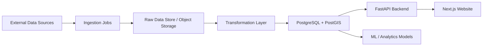

# Architecture Plan

## 1. Architectural Goals

The platform should be designed as a modular, data-driven product that can evolve from an MVP housing insight dashboard into a fuller intelligence platform over time.

Recommended principles:

- keep the first version simple and maintainable
- separate ingestion, transformation, analytics, API, and frontend concerns
- favour open-source tools where possible
- make it easy to swap data sources and ML components later
- support geospatial analysis from the start

---

## 2. Recommended High-Level Architecture

A strong initial architecture would look like this:

- Ingestion layer: scheduled Python jobs that pull data from APIs, CSVs, and other public sources
- Storage layer: PostgreSQL with PostGIS for structured and geospatial data
- Processing layer: Python-based ETL/transform scripts, optionally with dbt for analytics modelling
- API layer: FastAPI to serve structured summaries, search results, metrics, and chart data
- Frontend layer: Next.js or React for the website and dashboard experience
- Deployment layer: Docker-based deployment with CI/CD and cloud hosting

### Simple system view

---

## 3. Suggested Technology Options

### 3.1 Core Languages

Recommended:

- Python: best fit for ingestion, data cleaning, analytics and ML
- TypeScript / JavaScript: ideal for the frontend website
- SQL: for data modelling and querying in PostgreSQL
- Optional: R for exploratory analysis, but not required for MVP

### 3.2 Recommended Software Stack

#### Option A: Lean MVP (recommended)

Best for getting to market quickly with lower cost and lower complexity.

- Frontend: Next.js
- Backend/API: FastAPI
- Data processing: Python + pandas + requests + sqlalchemy
- Database: PostgreSQL + PostGIS
- Scheduling: cron jobs or Prefect
- Containerisation: Docker
- Hosting: Vercel for frontend, Render or Azure App Service for API, Azure Database for PostgreSQL or managed PostgreSQL
- CI/CD: GitHub Actions

#### Option B: More scalable analytics stack

Best for larger datasets, more robust orchestration, and stronger long-term data engineering.

- Frontend: Next.js
- Backend/API: FastAPI
- Data processing: Python + pandas + dbt + Airflow or Prefect
- Database: PostgreSQL/PostGIS or Snowflake/BigQuery for larger scale
- Storage: S3 / Azure Blob Storage for raw data
- Deployment: Azure, AWS, or GCP
- Monitoring: Dagster or Prefect for job orchestration and observability

#### Option C: Lowest-cost / fastest prototype

Best for a lightweight prototype or proof of concept.

- Frontend: simple React app or even a static site with plain HTML/CSS/JS
- Backend: Python scripts only, no full API initially
- Database: SQLite or Supabase Postgres
- Data processing: notebooks and scripts
- Hosting: Vercel or GitHub Pages for frontend, Supabase for data if needed

---

## 4. Ingestion Layer Design

This layer is responsible for collecting data from multiple sources and turning it into something usable.

### Likely responsibilities

- fetch data from public APIs
- download CSV/JSON/ZIP files
- normalize and validate incoming data
- manage schedules and retries
- track source freshness and data quality

### Suggested implementation

- Python scripts for extraction
- pandas for transformation
- requests or httpx for API calls
- BeautifulSoup or lxml for scraping where necessary
- JSON and CSV staging files for raw data storage
- optional object storage such as Azure Blob Storage or AWS S3

### Ingestion options

#### Option 1: Simple scheduled scripts

Good for initial versions.

- cron or GitHub Actions schedule data refreshes
- each job runs one source at a time
- simple logging and failure notifications

#### Option 2: Workflow orchestrator

Better for more robust pipelines.

- Prefect or Airflow for retries, dependencies, alerts, and scheduling
- useful once there are many data sources

#### Option 3: SaaS ingestion tools

Useful if the project grows quickly.

- Fivetran or Airbyte for managed ingestion
- good if you want less engineering overhead

### Recommended initial approach

Use Python-based ingestion jobs with a raw-to-cleaned pipeline, then upgrade to Prefect or Airflow later if the number of sources grows.

---

## 5. Modelling and Analytics Layer

This layer turns raw data into analytic tables, summaries, and machine learning features.

### Suggested components

- Python for transformations and feature engineering
- pandas for tabular data manipulation
- scikit-learn for simple prediction or classification models
- statsmodels or Prophet for time-series forecasting where relevant
- dbt for structured transformations if you want more robust SQL-based modelling
- PostgreSQL/PostGIS for storage and geospatial queries

### Suggested data model approach

You could organise the data into a few core layers:

1. Raw layer
   - source data exactly as received
   - preserved for auditability

2. Staging layer
   - cleaned and standardised records
   - consistent column names and types

3. Core analytics layer
   - area summaries
   - property metrics
   - time-series trends
   - geospatial boundary data

4. Feature layer
   - model-ready datasets for predictions or recommender logic

### Modelling options

#### Option 1: Rule-based analytics first

Use this for the MVP.

- descriptive analytics only
- no prediction required initially
- faster to build and easier to explain

#### Option 2: Lightweight ML later

Add prediction once the data pipeline is stable.

- house price trend prediction
- area score or attractiveness ranking
- affordability or risk scoring

#### Option 3: Advanced AI layer

Later-stage addition.

- NLP summary generation
- conversational assistant
- explainable AI for area insights

### Recommended initial approach

Build a strong analytical core first, then add ML once the data quality and user needs are proven.

---

## 6. API Layer Design

The API should provide structured access to the website and future clients.

### Suggested API responsibilities

- area search by postcode, town, or local authority
- area summary responses
- chart data for trends and comparisons
- property metrics and market statistics
- comparison endpoints for multiple areas

### Recommended stack

- FastAPI for the API
- Pydantic for request/response validation
- SQLAlchemy for database access
- Uvicorn for serving the app

### API shape

Example endpoints:

- GET /health
- GET /areas/search?q=postcode-or-town
- GET /areas/{id}/summary
- GET /areas/{id}/history
- GET /compare?areas=area1,area2,area3

### API options

- REST API: best fit for this project
- GraphQL: useful only if the frontend becomes very complex

### Recommended initial approach

Use REST with simple, well-documented JSON responses.

---

## 7. Website / Frontend Design

The website should be focused on clear discovery and insight, not just raw data.

### Suggested frontend experience

- search bar for postcode, town, or local authority
- area overview page with key metrics
- charts for price trends and local context
- map-based exploration of areas
- comparison view for multiple locations
- clear explanation of why a location is strong or weak

### Recommended frontend stack

- Next.js for routing, server-side rendering, and strong DX
- React for UI components
- Tailwind CSS for styling
- Recharts or Plotly for charts
- Leaflet or Mapbox for maps

### Website options

#### Option 1: Dashboard-first website

Best for MVP.

- simple landing page
- search-driven area pages
- charts and summaries
- minimal auth

#### Option 2: Data-rich exploration platform

Better for growth.

- advanced filters
- compare multiple locations
- saved searches
- richer map interactions

#### Option 3: AI-assisted experience

Later-phase enhancement.

- chatbot-style assistant
- conversational questions about areas
- AI-generated summaries

### Recommended initial approach

Build a polished dashboard-first website with a strong search experience and clear area pages.

---

## 8. Database and Geospatial Design

Because this project is about places and areas, geospatial support should be considered from the start.

### Recommended database choice

- PostgreSQL + PostGIS

### Why this is a good fit

- supports geospatial queries well
- handles structured analytics efficiently
- works well with FastAPI and Python workflows
- easy to evolve into a more complex analytical platform

### Suggested datasets to model

- area boundaries
- postcode-to-area mappings
- property price history
- demographic or census summaries
- transport and connectivity metrics
- EPC or energy-related datasets

---

## 9. Deployment and Operations

### Suggested deployment architecture

- frontend hosted on Vercel
- backend API on Render or Azure App Service
- PostgreSQL on a managed service
- object storage for raw files
- Docker for local development and consistency

### Recommended DevOps tooling

- GitHub Actions for CI/CD
- Docker Compose for local development
- basic logging and monitoring from day one
- alerting on failed ingestion jobs and API errors

### Operational concerns to plan for

- data freshness monitoring
- source failure handling
- schema change detection
- API uptime and latency
- data quality checks

---

## 10. Recommended MVP Architecture

For the initial version, I recommend the following combination:

- Python for ingestion and modelling
- FastAPI for the API
- PostgreSQL + PostGIS for the database
- Next.js for the website
- Docker for portability
- GitHub Actions for deployment automation
- Vercel + Render/Azure for hosting

This gives you a good balance of:

- speed of development
- maintainability
- strong data handling capability
- flexibility for future ML and AI features

---

## 11. Suggested Evolution Path

### Phase 1: MVP

- basic ingestion from a few public sources
- cleaned analytical tables
- search and area summary pages
- charts and comparison views
- basic API

### Phase 2: Analytics maturity

- scheduled pipelines
- better data quality checks
- richer geospatial analysis
- improved dashboards

### Phase 3: Intelligence layer

- predictive models
- AI-generated explanations
- recommendations and personalisation

---

## 12. Final Recommendation

If the goal is to build a strong but practical first version, the best choice is:

- Python for data work
- FastAPI for the backend
- PostgreSQL/PostGIS for storage
- Next.js for the website
- Docker and GitHub Actions for deployment

That stack is well-suited to this project because it supports ingestion, geospatial analysis, API services, and future ML work without overcomplicating the first release.
